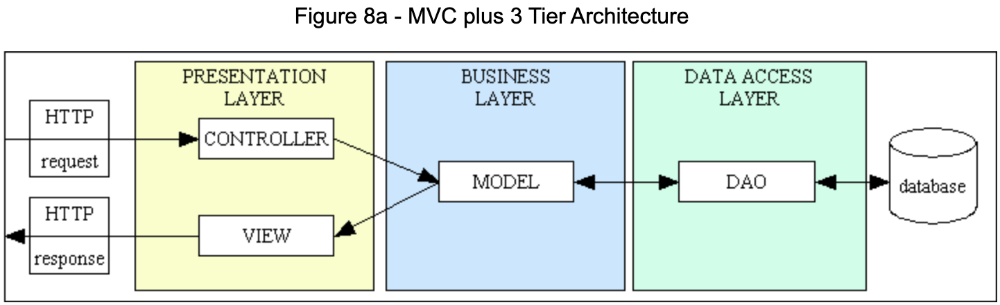

# Software Design Project, UBFLIX
The aim of this project was to learn the software design principles, such as SOLID, FURPS, TDD and design patterns.

## Installation

There are no additional required intallations to run the project, only have a suitable Java IDE.

## Usage

Run the project with the Java IDE and the UI will appear. The objective of the project was to create an UI to simulate some Netflix functionalities, such as watch series, save them to several lists and grade them.

## Structure of the project

The project is composed of three layers:
- The presentation layer (controller+view)
- The business layer (model)
- The data access layer (DAO)

